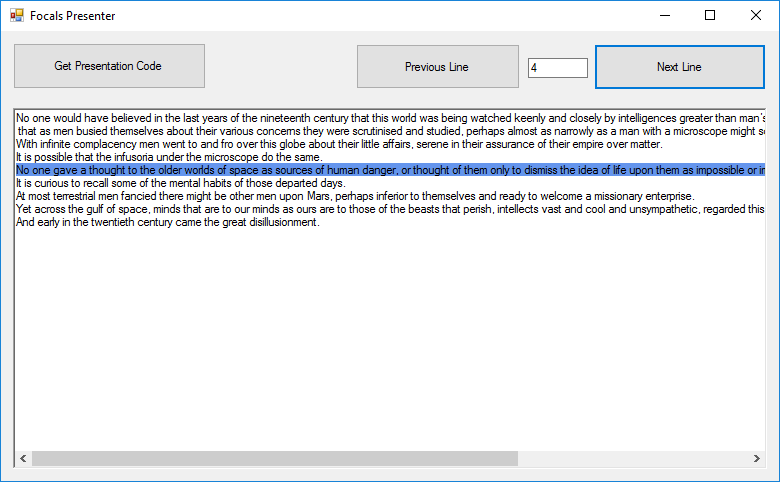

# FocalsMessenger
A local control to display arbitrary text on North's Focals smart glasses using the Chrome presenter

## Do What Now?
North's Focals smart glasses have this really neat [Chrome extension](https://chrome.google.com/webstore/detail/focals-connect/eenbehcfbcnnfjdhdldhdbcpamomofoe) that allows you use your Focals as a slideshow presentation companion. You can read the presenters notes on the glasses, and control the slides. But this is limited to just Chrome and just Google Slides.

This application allows you to display any arbitrary text on your Focals using the same mechanisim as the Chrome extension. Paste your text into the box, and each new line will be treated as a slide.

## How To Use
* Paste your text into the textbox. Note that each individual line is treated as a slide. You can use \  in your text to add line breaks.  
* Click the "Get Presentation Code" button in the top left.    
* On your Focals, click on the "Connect to Chrome" tile and then enter the three letter code you see in the app.  
* Use either the buttons in the app or press left/right on the loop to switch between "slides".  
* Be sure to demand North gives me an SDK so I can make better stuff!  
